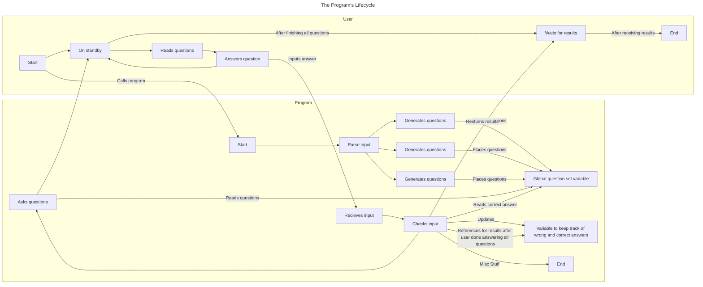

# This is the homepage for the command-line-interface part of the wiki.

## The Program's Lifecycle

I am not sure if I am using those words correctly but what I mean is all the program's processes from when it is called to when it is terminated. Below if a diagram detailing the program's lifecycle and its interactions with the user.

## Docs

To get started you can look through the docs to understand more about the program. You should first start with [**parsing the options**](https://github.com/Jigchu/Math-trainer/wiki/Options)